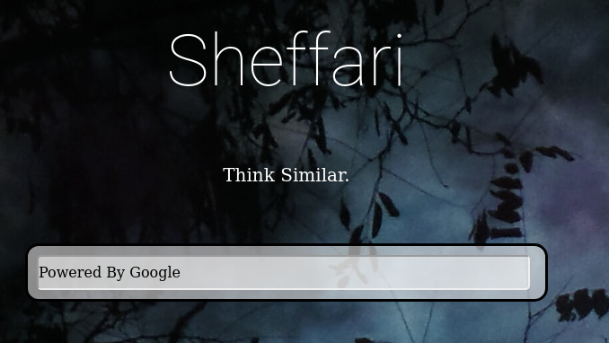
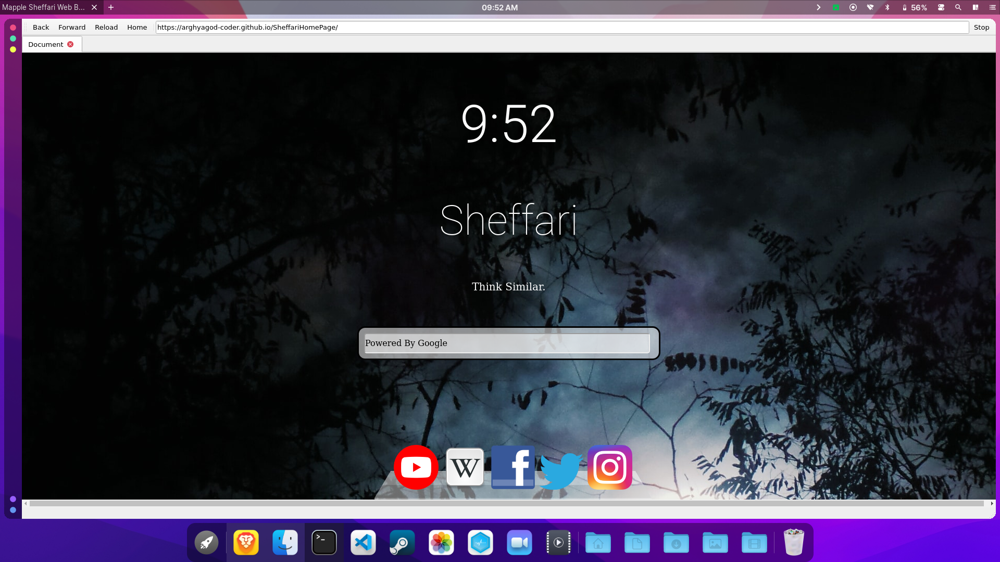

# Sheffari-Browser
Kinda clone of the Safari Browser, another addition to [MkOsh Project](https://github.com/Mengo-Team/MkOsh). I decided to make one Safari-type app for MkOsh. Just for fun! The MkOsh project goes more interesting in every step I proceed. It's kinda like a custom suite of applications. 



<hr><br><hr>

## ✨ Features

- Fits Perfect on my [MkOsh Monterey](https://github.com/Mengo-Team/MkOsh) theme
- Lightweight
- Not much of features, hence as some say, **BLOATLESS**
- Has some serious beauty out there
- Works on all linux based systems and Windows

<hr>
<br>
<hr>

## ⚡️ Installation
### **For Linux users:**

Now install depends on which shell you use

#### Bash Users:

```bash
curl https://raw.githubusercontent.com/MengoTeam/Sheffari-Browser/master/bash_install.sh > minstall.sh;chmod +x ./minstall.sh;sudo bash ./minstall.sh
```

#### Fish Users:

```bash
curl https://raw.githubusercontent.com/Mengo-Team/Sheffari-Browser/master/fish_install.sh > minstall.sh;chmod +x ./minstall.sh;sudo fish ./minstall.sh
```

#### Zsh Users:

```bash
curl https://raw.githubusercontent.com/Mengo-Team/Sheffari-Browser/master/zsh_install.sh > minstall.sh; chmod +x ./minstall.sh;sudo zsh ./minstall.sh
```

<hr>

### **For Windows users:**

Download the [exe file](https://github.com/Mengo-Team/Sheffari-Browser/releases/download/0.1.4/sheffari_windows.exe) and run it.

<hr><br><hr>

## 💡 Usage
Just check your launcher/menu, the app will be there. 



<hr>
<br>
<hr>

## More of MkOsh Project:

- [The Desktop](https://github.com/Mengo-Team/MkOsh)

- [About The MkOsh App](https://github.com/Mengo-Team/MkAbout)
